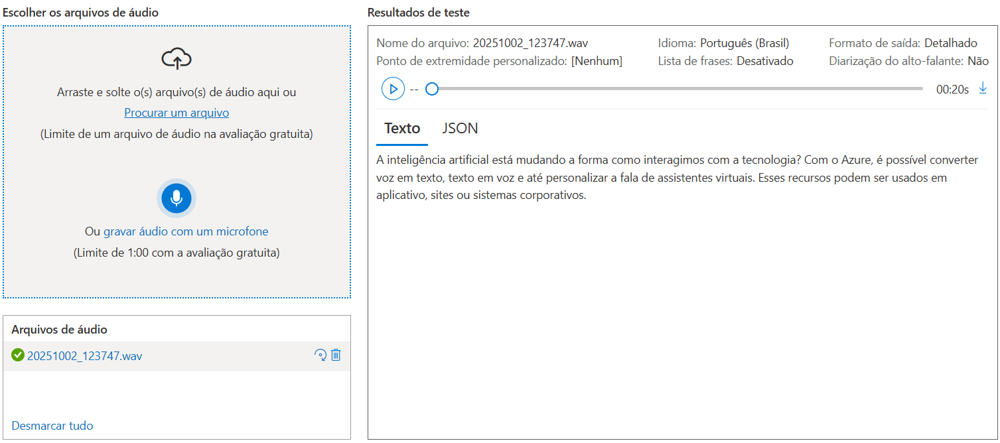
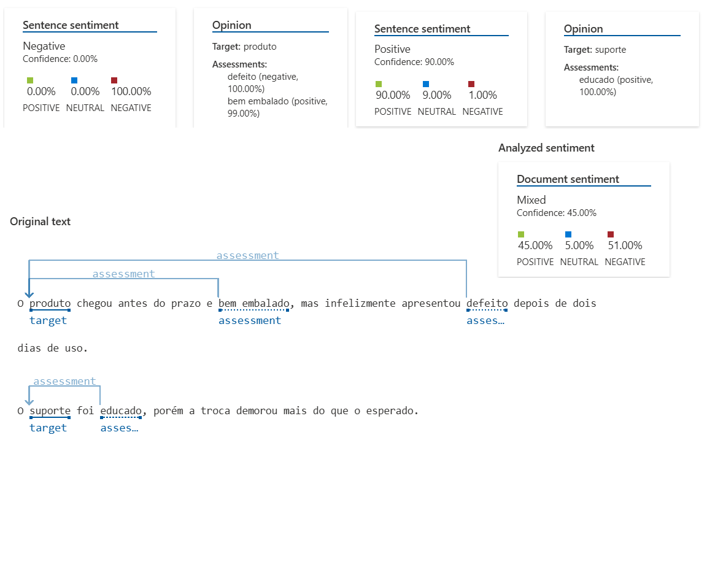

# 🗣️ Azure Speech Studio & Language Studio - Laboratório Prático

## 👨‍💻 Autor

**Diogo Barbosa**  
Desenvolvedor FullStack  
[GitHub](https://github.com/Pitonico/) | [LinkedIn](https://www.linkedin.com/in/diogogosson/)

---

## 🎯 Objetivo

Este repositório documenta a prática realizada com as ferramentas **Azure Speech Studio** e **Azure Language Studio**, explorando os recursos de **análise de fala e linguagem natural** do Microsoft Azure.  
O objetivo é registrar observações, aprendizados e resultados obtidos durante o laboratório prático.

---

## 🧩 Ferramentas Utilizadas

- [Speech Studio](https://speech.microsoft.com/)
- [Language Studio](https://language.cognitive.azure.com/)
- [Microsoft Azure Portal](https://portal.azure.com/)
- [GitHub](https://github.com)

---

## 🧠 Etapas Realizadas

### 🔹 Speech Studio

#### 🔸 Experimento 1 — Fala para Texto (Speech-to-Text)

- Teste com um áudio em português.
- O modelo converteu com **alta precisão**, apenas pequenas falhas em entonações, trocando alguns sinais de pontuação.
- Observação: o serviço funciona em tempo real e com upload de arquivos `.wav` ou `.mp3`.

#### 🔸 Experimento 2 — Texto para Fala (Text-to-Speech)

- Coerente com o texto e audível, com várias opções de vozes, personalização e ajustes

---

### 🔹 Language Studio

#### 🔸 Experimento 3 — Análise de Sentimentos

- Frase usada: “O produto chegou antes do prazo e bem embalado, mas infelizmente apresentou defeito depois de dois dias de uso. O suporte foi educado, porém a troca demorou mais do que o esperado.”
- Resultado: **Sentimento misto (positivo e negativo)**
- Observação: o modelo compreendeu nuances de emoção no texto na maioria, mas faltou em reconhecer outras.

#### 🔸 Experimento 4 — Reconhecimento de Entidades (NER)

- Texto: “Em abril de 2024, a Microsoft lançou o Copilot para o Outlook durante um evento em São Paulo.
  O anúncio foi feito pelo CEO Satya Nadella e incluiu investimentos de 500 milhões de dólares na expansão do Azure no Brasil.”
- Resultado: Exemplo de entidades detectadas:
  - Organização: Microsoft
  - Local: São Paulo
- Observação: Otima precisão para nomes próprios, locais, quantidades e datas.

#### 🔸 Experimento 5 — Detector de Linguagem

- Detectou várias linguagens testadas, entre elas algumas bem desconhecidas.

#### 🔸 Experimento 6 — Palavras-chave

- Texto: “Em abril de 2024, a Microsoft lançou o Copilot para o Outlook durante um evento em São Paulo.
  O anúncio foi feito pelo CEO Satya Nadella e incluiu investimentos de 500 milhões de dólares na expansão do Azure no Brasil.”
- Resultado: Palavras-chave detectadas: CEO Satya Nadella, São Paulo, expansão, anúncio, 500 milhões, dólares, abril, Microsoft, Copilot, Outlook, evento, investimentos, Azure, Brasil
- Observação: Detectou todas a palavras realmente importantes.

---

## 📸 Evidências

Capturas de tela estão disponíveis na pasta [`/images`](./images).

Exemplo:

- 
- 

---

## 💡 Insights e Aprendizados

- As ferramentas da Azure facilitam o uso de **IA aplicada à voz e linguagem** sem necessidade de código.
- O **Speech Studio** é ideal para criar legendas automáticas, assistentes virtuais e controle por voz.
- O **Language Studio** é útil para análise de sentimentos, extração de entidades e chatbots inteligentes.
- Aprendi a importância de combinar fala e linguagem para oferecer **experiências de usuário mais naturais**.

---

## 🚀 Próximos Passos Futuros

- Integrar o Speech-to-Text em um aplicativo web.
- Testar APIs REST do Azure Cognitive Services em C# ou Node.js.
- Criar um bot com integração de voz e análise de intenção.

---

## 📚 Referências

- [Documentação Speech Studio (Microsoft Learn)](https://learn.microsoft.com/en-us/training/modules/explore-speech-studio/)
- [Documentação Language Studio (Microsoft Learn)](https://learn.microsoft.com/en-us/training/modules/analyze-text-with-language-studio/)
- [GitHub Docs - Markdown Guide](https://docs.github.com/en/get-started/writing-on-github)

---

## 🧾 Licença

Este repositório é de uso educacional, criado como parte de um desafio de laboratório prático sobre IA no Azure.
